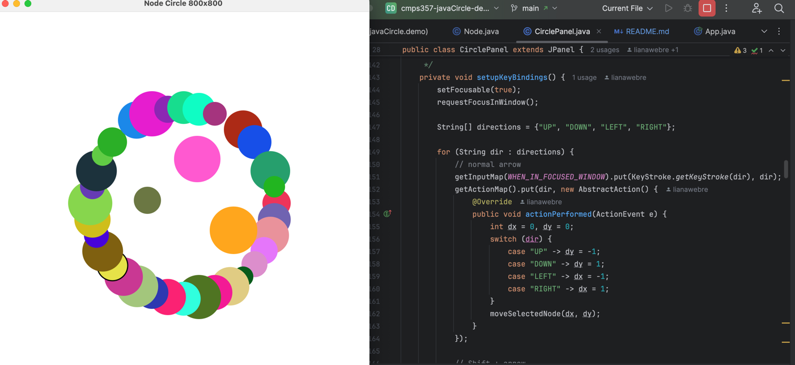

# Java Circle Demo

A Java Swing application that demonstrates interactive circle manipulation with a graphical user interface. This project showcases object-oriented programming concepts, event handling, and custom graphics rendering.

## Features

- **Interactive Circle Display**: 36 colorful circles arranged in a circular pattern
- **Mouse Interaction**: Click and drag circles to move them around the screen
- **Keyboard Interaction**: Use arrow keys to move selected circles; Shift + arrow moves faster.
- **Smooth Graphics**: Anti-aliased rendering for crisp visual appearance
- **Responsive UI**: Real-time updates as you interact with the circles
- **800x800 Window**: Optimized display size for comfortable interaction
- **JSON Import/Export**: Save and load circle layouts to and from JSON files


## Project Structure

```
src/main/java/com/example/
├── App.java          # Main application entry point
├── CirclePanel.java  # Custom JPanel for rendering and interaction
└── Node.java         # Circle node representation class
```

## How It Works

1. **App.java**: Main class that creates the JFrame window and initializes the application
2. **CirclePanel.java**: Custom panel that manages the circle layout, mouse events, key bindings, and rendering
3. **Node.java**: Represents individual circles with position, color, and radius properties

The application creates 36 nodes arranged in a circular pattern around the center of the window. Users can click and drag any circle to move it to a new position, with real-time visual feedback.

## Requirements

- Java 11 or higher
- No external dependencies (uses only Java Swing and AWT)

## How to Run

### Option 1: Direct Java Compilation
```bash
# Compile the Java files
javac -d target/classes src/main/java/edu/louisiana/cmps357/C00546097/*.java

# Run the application
java -cp target/classes edu.louisiana.cmps357.C00546097.App
```

### Option 2: IDE
Open the project in your preferred Java IDE (IntelliJ IDEA, Eclipse, VS Code) and run the `App.java` file.

## Usage

1. Launch the application
2. A window will appear with 36 colorful circles arranged in a circle
3. Click and drag any circle to move it around the screen
   - Or, select and use arrow keys to move any circle.
4. You can resize the window as you like; the circles will stay centered and scale their positions and sizes accordingly
4. The cursor will change to a hand when hovering over a circle
5. Close the window to exit the application

## Technical Details

- **Window Size**: 800x800 pixels
- **Circle Radius**: 200 pixels for the arrangement pattern
- **Number of Nodes**: 36 circles
- **Graphics**: Anti-aliased rendering for smooth appearance
- **Event Handling**:
    - **Mouse Events**: Press, drag, and release to select and move nodes.
    - **Keyboard Events**: Arrow key presses to move selected nodes; Shift + arrow for larger movement.
- **Thread Safety**: Uses `SwingUtilities.invokeLater()` for proper Swing initialization
- **Window Resize Scaling**: Nodes scale their positions and radii once resizing stops to maintain relative layout.


## Development

This project demonstrates several Java programming concepts:
- Custom Swing components
- Event-driven programming
- Graphics rendering with Graphics2D
- Object-oriented design
- Mouse interaction handling
- Keyboard interaction handling
- Window resize scaling
- JSON serialization of node positions, radii, and colors

## Screenshot


## Author

Liana Webre

## License

This project is open source and available under the MIT License.
